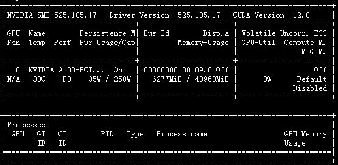

# baichuan-Qlora-Tuning
基于qlora对baichuan-7B大模型进行指令微调。

# 依赖

```python
mpi4py
transformers==4.28.1
peft==0.3.0
icetk
deepspeed==0.9.2
accelerate
cpm_kernels
sentencepiece==0.1.99
peft=0.3.0
torch=2.0.0 
```

版本为最新的也行。

# 目录结构

```pyrhon
--data
----msra
------train.txt
------eval.txt
--checkpoint
----baichuan
------adapter_model
--model_hub
----baichuan-7B
--baichuan_qlora.py  # 训练
--dataset.py  # 处理数据
--predict.py  # 交互式闲聊
--test_baichuan.py  # 测试baichuan模型
--train.log  # 训练日志
```

# 一般步骤

##  数据格式

train.txt和eval.txt里面的数据格式是一致的，每一行为一条样本，具体为：

```python
{"instruct": "你现在是一个实体识别模型，你需要提取文本里面的人名、地名、机构名，如果存在结果，返回'实体_实体类型'，不同实体间用\n分隔。如果没有结果，回答'没有'。", "query": "文本：因有关日寇在京掠夺文物详情，藏界较为重视，也是我们收藏北京史料中的要件之一。", "answer": "日_地名\n京_地名\n北京_地名"}
```

instruct为指令，query为文本，answer为结果，可以根据自己的数据自行构建。

在baichuan_qlora.py里面可以定义这三种列的名称。

## 训练

去hugging face下载baichuan-7B相关文件到model_hub/baichuan-7B下，下载完成后可以用`python test_baichuan.pt`进行测试模型。构建好数据集之后直接运行：

```python
python baichaun_qlora.py
```

## 预测

训练完成后可以使用以下指令进行预测：

```python
python predict.py --model_name "baichuan" --base_model "./model_hub/baichuan-7B" --tokenizer_path "./model_hub/baichuan-7B" --lora_model "./checkpoint/baichuan/adapter_model" --with_prompt --interactive
```

预测结果：

```python
加载模型耗时：0.6068947672843933分钟
loading peft model
Start inference with instruction mode.
=====================================================================================
+ 当前使用的模型是：baichuan
-------------------------------------------------------------------------------------
+ 该模式下仅支持单轮问答，无多轮对话能力。
=====================================================================================
Input:你现在是一个实体识别模型，你需要提取文本里面的人名、地名、机构名，如果存在结果，返回'实体_实体类型'，不同实体间用\n分隔。如果没有结果，回答'没有'。文本：我们是受到郑振铎先生、阿英先生著作的启示，从个人条件出发，瞄准现代出版史研究的空白，重点集藏解放区、国民党毁禁出版物。
Response:  郑振铎_人名
阿英_人名


Input:你现在是一个实体识别模型，你需要提取文本里面的人名、地名、机构名，如果存在结果，返回'实体_实体类型'，不同实体间用\n分隔。如果没有结果，回答'没有'。文本：藏书家、作家姜德明先生在1997年出版的书话专集《文林枝叶》中以“爱书的朋友”为题，详细介绍了我们夫妇的藏品及三口之家以书为友、好乐清贫的逸闻趣事。
Response:  姜德明_人名


Input:你现在是一个实体识别模型，你需要提取文本里面的人名、地名、机构名，如果存在结果，返回'实体_实体类型'，不同实体间用\n分隔。如果没有结果，回答'没有'。文本：去年，我们又被评为“北京市首届家庭藏书状元明星户”。
Response:  北京_地名
```

有一定的效果，但是并不是很好，可能需要调调参，训练更长的时间。

预测使用的显存：



# 补充

- **如何训练自己的数据？ **只需要构建好上述数据所需的格式，然后修改baichuan_qlora里面数据的地址即可，当然也可修改其它的一些参数。
- **如何使用其它的模型？** 其它模型的不同在于两个方面：1、数据的输入格式不一样。2、模型加载的方式不一样。对于chatglm、llama、belle，可以参考之前所做的：https://github.com/taishan1994/qlora-chinese-LLM

# 参考

> https://github.com/wp931120/baichuan_sft_lora
>
> https://github.com/baichuan-inc/baichuan-7B
>
> https://github.com/artidoro/qlora/
>
> https://github.com/taishan1994/qlora-chinese-LLM
